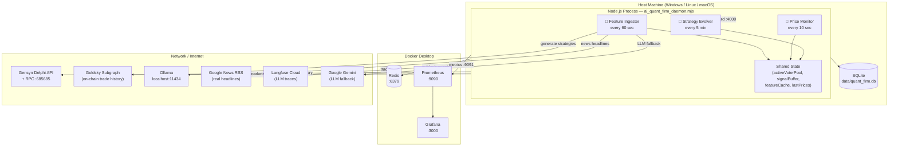
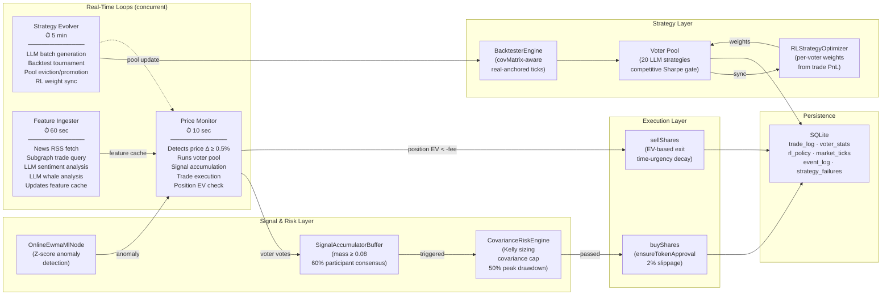
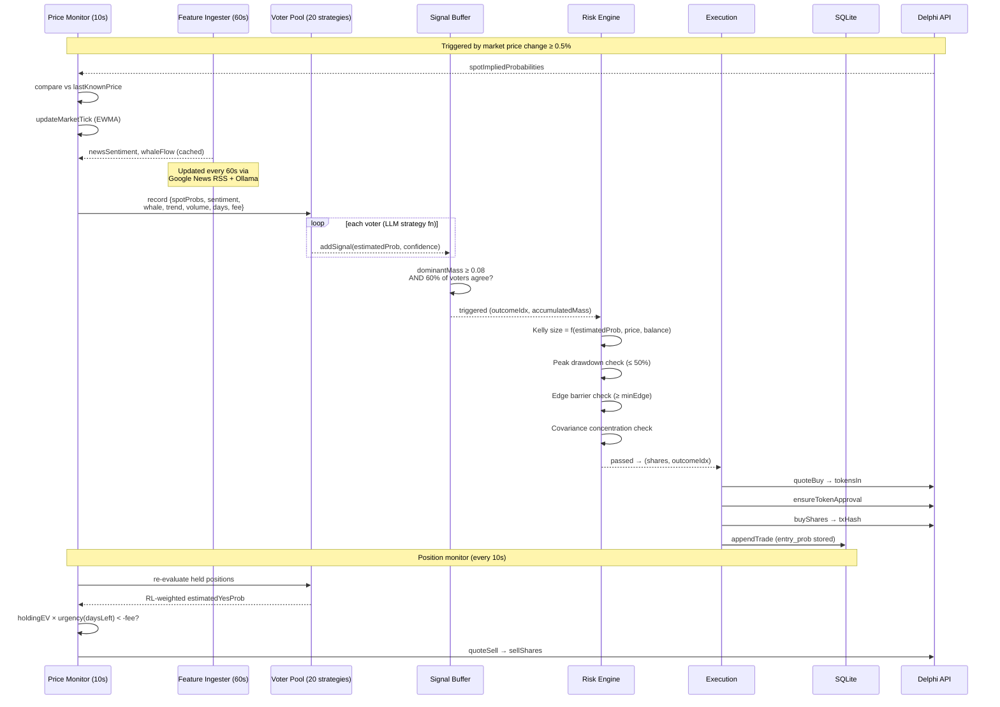

# System Design Document

## 1. Purpose and Scope

This document describes the end-to-end architecture for the Gensyn Delphi AI Quant Firm — a real-time, event-driven multi-agent trading system for Gensyn Delphi prediction markets.

---

## 2. Physical Architecture Design

Deployment topology: Node.js processes on host, infra services in Docker Desktop.

---

## 3. System Design

Internal component responsibilities and data flows.

---

## 4. Solution Design

End-to-end decision flow for a single trade signal.

---

## 6. Component Reference

The system is a real-time event-driven multi-agent trading pipeline with three concurrent loops:

- **Strategy Evolver** (5 min) — LLM batch generation, competitive backtesting, pool management
- **Price Monitor** (10 sec) — reactive voter evaluation on price changes, signal accumulation, trade execution, position EV management
- **Feature Ingester** (60 sec) — Google News RSS fetch, subgraph whale analysis, LLM enrichment, cache refresh

Primary entry point: `node quant_firm/ai_quant_firm_daemon.mjs`

## 7. Components and Interactions

### 3.1 Internal Components

#### Core quant_firm components

- `quant_firm/ai_quant_firm_orchestrator.mjs`
  - Coordinates one full strategy-to-trade cycle.
  - Pulls data, triggers strategy generation/backtest, applies risk checks, and dispatches execution.

- `quant_firm/ai_quant_firm_daemon.mjs`
  - Repeats orchestration loop on interval for continuous operation.

- `quant_firm/unified_feature_store.mjs`
  - Writes/reads multi-source market features.
  - Persists structured signals and state to SQLite.

- `quant_firm/llm_strategy_generator*.mjs` and `quant_firm/ollama_strategy_generator_node.mjs`
  - Generates candidate trading logic using configured LLM provider.

- `quant_firm/voter_pool_validator.mjs`
  - Maintains active pool of candidate strategies.
  - Filters stale/underperforming strategies.

- `quant_firm/covariance_risk_engine.mjs`
  - Enforces concentration, covariance, and pre-trade safety checks.
  - Produces size/risk decision input for execution.

#### quant_system components

- `quant_system/backtester_engine.mjs`
  - Replays historical feature windows.
  - Computes quality metrics (e.g., win-rate/sharpe-like performance indicators).

- `quant_system/ml_strategy_tournament_agent.mjs`
  - Compares candidates and emits selected strategy set.

- `quant_system/pre_trade_risk_engine.mjs`
  - Additional risk checks before order intent generation.

#### event_system components

- `event_system/event_bus.mjs`
  - Internal pub/sub event transport abstraction.
  - Uses Redis when available; can run in in-process mode.

- `event_system/news_sentiment_node.mjs`
  - Emits event signals from news/sentiment context.

- `event_system/adversarial_watcher_node.mjs`
  - Emits event signals from whale/adversarial market observations.

- `event_system/consensus_node.mjs`
  - Aggregates per-node outputs into consensus signals.

- `event_system/rl_validator_node.mjs`
  - Applies adaptive weighting/meta-policy updates.

- `event_system/signal_buffer_node.mjs`
  - Buffers and combines aligned signals before execution.

- `event_system/executor_node.mjs`
  - Converts validated signal into on-chain actions through Delphi SDK.

### 3.2 Telemetry components

- `telemetry/prometheus_exporter.mjs`
  - Exposes metrics endpoint for scrape.

- `telemetry/telemetry_dashboard_server.mjs`
  - Local dashboard for live runtime and strategy state.

- `telemetry/langfuse_tracer.mjs`
  - Captures LLM prompt/response traces for observability.

## 8. External Services and Dependencies

### Required external service

- **Gensyn Delphi API / chain-facing endpoints**
  - Used for market reads and execution paths through SDK.

### Optional external/internal services

- **Ollama** (`http://localhost:11434`)
  - Local model host for strategy generation.

- **Redis** (`redis://localhost:6379`)
  - Cross-process pub/sub event transport.

- **Prometheus** (`http://localhost:9090`)
  - Scrapes application metrics.

- **Grafana** (`http://localhost:3000`)
  - Dashboard visualization of Prometheus metrics.

- **Langfuse Cloud/Self-host**
  - Optional LLM tracing backend.

## 9. Persistence and Data Stores

- **SQLite**: `data/quant_firm.db`
  - Feature snapshots
  - Trade logs
  - Voter/strategy stats
  - RL policy and state metadata

- **In-memory/event buffers**
  - Short-lived signal aggregation and pipeline state between event nodes.

## 10. End-to-End Interaction Flow

1. Ingestion nodes collect market/news/whale context and write to feature store.
2. Strategy generators produce candidate decision logic from recent features.
3. Backtester/tournament ranks candidates and emits active strategy subset.
4. Validator + RL node update weights and reject weak/stale candidates.
5. Risk engine applies pre-trade safety constraints.
6. Signal buffer consolidates qualified intents.
7. Executor node submits approved order flow to Delphi market interfaces.
8. Execution results feed telemetry and persistence.
9. Prometheus/Grafana/dashboard expose runtime state and performance.

## 11. Windows Runtime Topology

On Windows, recommended deployment is hybrid:

- Host processes:
  - Node runtime components (`quant_firm`, `event_system`, `quant_system`, telemetry server)
- Docker Desktop containers:
  - Redis
  - Prometheus
  - Grafana

Network assumptions:
- Host services are accessed by containers via `host.docker.internal`.
- Compose-internal calls use service DNS names (e.g., `prometheus`).

## 12. Operations and Monitoring

### Health/visibility endpoints

- Telemetry dashboard: `http://localhost:4000`
- Prometheus UI: `http://localhost:9090`
- Grafana UI: `http://localhost:3000`

### Core observable signals

- LLM call count and latency proxies
- Active position count and wallet balances
- Circuit breaker status
- Risk/latency indicators and anomaly scores

## 13. Failure Modes and Degradation

- If Redis is down: event bus can fall back to in-process operation.
- If Grafana/Prometheus are down: trading pipeline can continue without dashboards.
- If Langfuse is unavailable: local execution continues without external trace sink.
- If LLM provider is unavailable: strategy generation paths depending on that provider degrade or pause depending on configuration.

## 14. Security and Secrets Boundaries

- Secrets (wallet key, Delphi key, optional cloud keys) are sourced from `.env` only.
- `.env` and runtime DB/artifacts must not be committed.
- Execution node should be treated as high-trust boundary due to signing and order submission.
