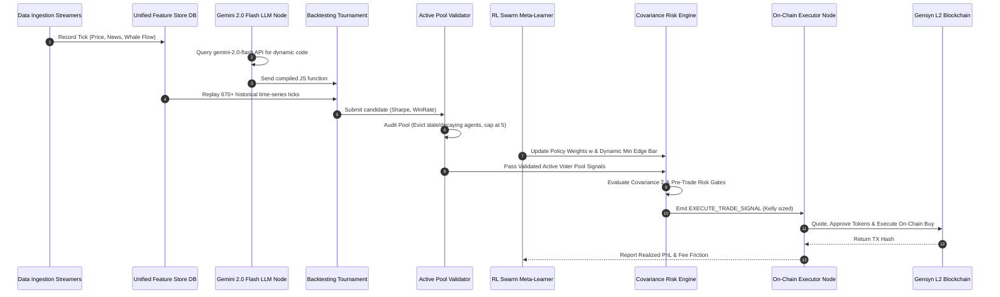

# 🏛️ Deep-Dive Architecture Specification

> **Gensyn Delphi Self-Evolving AI Quant Firm**

This document details the architectural design, mathematical foundations, IPC communication protocols, and execution pipelines powering the AI Quant Firm.

---

## 1. Mathematical Foundations

### A. Kelly Criterion Bet Sizing
Position sizing is dynamically calculated using the **Kelly Criterion** formula to maximize logarithmic wealth growth while capping downside risk:

$$f^* = \frac{p \cdot b - q}{b}$$

Where:
* $p = \text{Estimated true outcome probability from LLM strategy}$
* $q = 1 - p = \text{Complementary probability}$
* $b = \text{Net odds received on bet (1:1 baseline)}$
* $f^* = \text{Optimal capital allocation fraction (capped between 1% and 8%)}$

---

### B. Cross-Asset Covariance Matrix ($\mathbf{\Sigma}$)
To prevent over-concentrating capital in highly correlated markets (e.g. multiple crypto outcome assets), the **Covariance Risk Engine** calculates the sample covariance matrix $\mathbf{\Sigma}$ across historical probability time series:

$$\mathbf{\Sigma}_{ij} = \operatorname{Cov}(X_i, X_j) = \frac{1}{N - 1} \sum_{k=1}^{N} (X_{i,k} - \bar{X}_i)(X_{j,k} - \bar{X}_j)$$

Where $X_i$ and $X_j$ are implied probability trajectories of markets $i$ and $j$. Trades in categories exceeding maximum correlation thresholds are rejected by the pre-trade risk gateway.

---

### C. Reinforcement Learning Policy Weight Gradient Update
The **RL Swarm Meta-Learner Node** adjusts strategy weights $\mathbf{w} = [w_1, w_2, \dots, w_K]^T$ online based on realized reward signals $R_t$:

$$R_t = \text{PnL}_t - \text{FeeFriction}_t - \lambda \cdot \text{Drawdown}_t$$

$$w_i^{(t+1)} = \frac{w_i^{(t)} \cdot \exp(\eta \cdot R_t)}{\sum_{j=1}^{K} w_j^{(t)} \cdot \exp(\eta \cdot R_t)}$$

Where $\eta = 0.05$ is the learning rate and $\lambda$ is the drawdown penalty multiplier.

---

## 2. Event Interaction Sequence



---

## 3. Pre-Trade Risk Gateway Enforcements

Every proposed trade must clear **4 mandatory pre-trade risk gates** before reaching the executor node:

| Risk Gate | Threshold | Rationale |
| :--- | :--- | :--- |
| **Circuit Breaker** | `Max 2.0% Daily Drawdown` | Halts automated trading if daily loss exceeds 2% threshold |
| **Concentration Cap** | `Max 15% Exposure / 3 Max Correlated` | Prevents over-leveraging capital in correlated market categories |
| **Fee Friction Barrier** | `Min 6.0% Edge` | Ensures expected return exceeds round-trip fee friction (2% buy + 2% sell = 4%) |
| **RPC Latency Guard** | `Max 800ms Latency` | Rejects trades if RPC node latency spikes to prevent front-running |

---

## 4. Message Bus Contracts

Microservices communicate asynchronously via IPC Pub/Sub events:

```json
{
  "eventId": "evt_178596001",
  "type": "EXECUTE_TRADE_SIGNAL",
  "source": "signal_buffer_node",
  "timestamp": "2026-08-06T01:50:00.000Z",
  "payload": {
    "marketAddress": "0x1234...5678",
    "question": "Will Bitcoin touch 100k$ in August 2026?",
    "outcomeIdx": 0,
    "outcomeLabel": "YES",
    "sharesNum": 8,
    "kellyFraction": 0.064,
    "accumulatedMass": 0.42
  }
}
```
