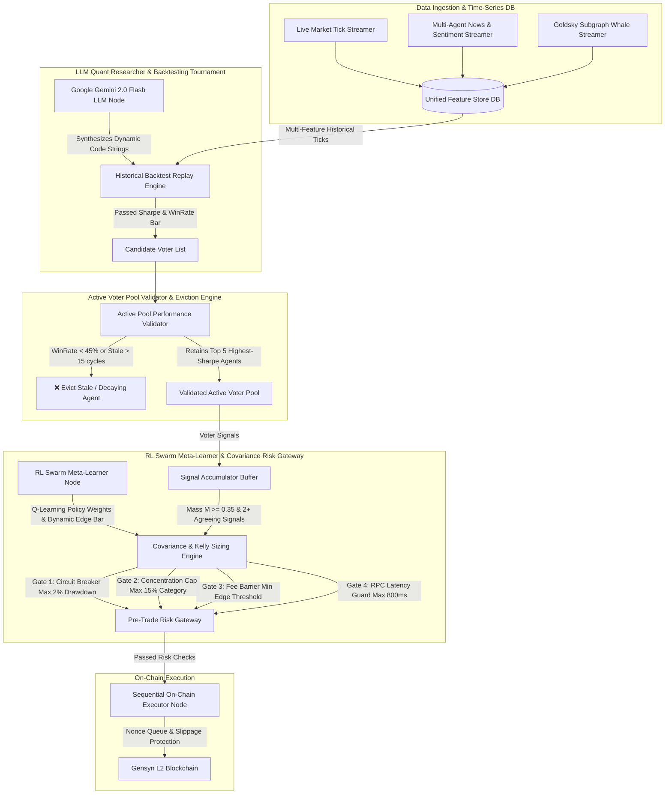

# 🤖 Gensyn Delphi AI Quant Firm

> **Self-Evolving, Distributed Event-Driven Multi-Agent Quantitative Trading System for Gensyn Delphi Information Markets**

An institutional-grade, self-evolving quantitative trading system powered by **Google Gemini API**, **Reinforcement Learning Meta-Learners**, **Covariance Risk Engines**, and **Event-Driven Pub/Sub Microservices**.

---

## 🏛️ System Architecture Overview



---

## 🌟 Key Features & Capabilities

* **🧠 Real Google Gemini API Strategy Generator (`llm_strategy_generator_real.mjs`)**: Queries `gemini-2.0-flash` to write raw JavaScript quantitative strategy code at runtime and compiles executable functions using `new Function()`.
* **🧪 Historical Backtester Engine (`backtester_engine.mjs`)**: Replays historical time-series tick datasets with **2% buy + 2% sell fee drag and slippage simulation**. Computes Sharpe Ratios, Win Rates, and Max Drawdown.
* **🧹 Active Voter Pool Eviction Engine (`voter_pool_validator.mjs`)**: Audits active voter performance in real-time. Automatically evicts stale strategies (0 trades in 15 cycles), underperforming strategies (WinRate $<45\%$), or out-of-capacity agents (max 5 capacity).
* **🧠 RL Swarm Meta-Learner Node (`rl_validator_node.mjs`)**: Runs online Q-learning/Policy Gradient steps to dynamically adjust strategy weight vector $\mathbf{w}$ and tune minimum required edge thresholds ($\theta_{\text{edge}}$).
* **📐 Covariance Risk Engine (`covariance_risk_engine.mjs`)**: Calculates Cross-Asset Covariance Matrix ($\mathbf{\Sigma}$), **Kelly Criterion** bet sizing, and enforces pre-trade risk gates (2% Max Drawdown, 15% Concentration Cap, Latency Guards).
* **📥 Signal Accumulator Buffer (`signal_buffer_node.mjs`)**: Buffers incoming signal vectors into cumulative mass ($M_{\text{accumulated}} \ge 0.35$). Replaces fragmented micro-buys with single size-optimized batch orders.
* **⚡ Sequential On-Chain Executor Node (`executor_node.mjs`)**: Submits batch orders on-chain via nonce-protected queue with automatic token approvals and slippage caps.

---

## 📁 Repository Structure

```text
c:/Users/user/dev/gensyn/
├── quant_firm/
│   ├── ai_quant_firm_daemon.mjs          # 24/7 Master AI Quant Firm Daemon Loop
│   ├── ai_quant_firm_orchestrator.mjs      # Single-pass execution orchestrator
│   ├── llm_strategy_generator_real.mjs    # Real Google Gemini API Strategy Generator Node
│   ├── unified_feature_store.mjs          # Multi-Feature Time-Series DB & Feature Store
│   ├── voter_pool_validator.mjs           # Active Pool Performance Validator & Eviction Engine
│   └── covariance_risk_engine.mjs         # Covariance Matrix & Portfolio Risk Engine
├── quant_system/
│   ├── backtester_engine.mjs              # Historical Backtest Replay Engine
│   ├── ml_strategy_tournament_agent.mjs   # ML Strategy Candidate Tournament
│   ├── pre_trade_risk_engine.mjs          # Standalone Pre-Trade Risk Engine
│   └── timeseries_feature_store.mjs       # Time-Series Tick Database
├── event_system/
│   ├── event_bus.mjs                      # Distributed IPC Pub/Sub Message Broker
│   ├── news_sentiment_node.mjs            # High-Frequency News & Sentiment Streamer Node
│   ├── adversarial_watcher_node.mjs       # Subgraph Whale Transaction Watcher Node
│   ├── consensus_node.mjs                 # Strategy & Consensus Engine Node
│   ├── rl_validator_node.mjs              # RL Swarm Meta-Learner & Audit Node
│   ├── signal_buffer_node.mjs             # Signal Accumulator Buffer Node
│   └── executor_node.mjs                  # Sequential On-Chain Executor Node
├── ARCHITECTURE.md                        # In-depth Technical Architecture Specification
├── QUICKSTART.md                          # Getting Started & Setup Guide
└── package.json                           # Node.js dependencies
```

---

## 🛠️ Quick Start

### 1. Environment Setup

Copy `.env.example` to `.env` and fill in your keys:

```env
DELPHI_API_ACCESS_KEY=your_delphi_key
DELPHI_SIGNER_TYPE=private_key
WALLET_PRIVATE_KEY=0x_your_private_key
GEMINI_API_KEY=AIzaSy_your_gemini_key
DELPHI_NETWORK=testnet
```

### 2. Install Dependencies

```bash
npm install
```

### 3. Run the AI Quant Firm Pipeline

```bash
node quant_firm/ai_quant_firm_orchestrator.mjs
```

### 4. Run the 24/7 Daemon

```bash
node quant_firm/ai_quant_firm_daemon.mjs
```

---

## 📄 License
MIT License
